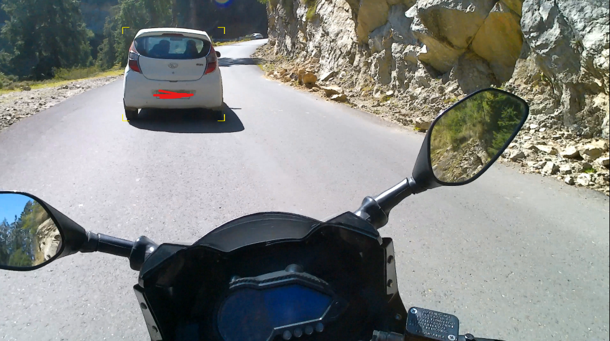
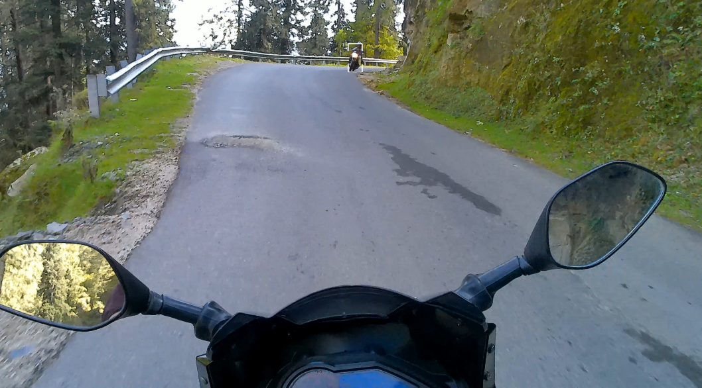
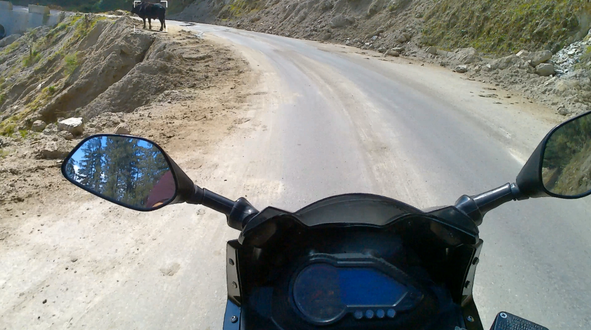
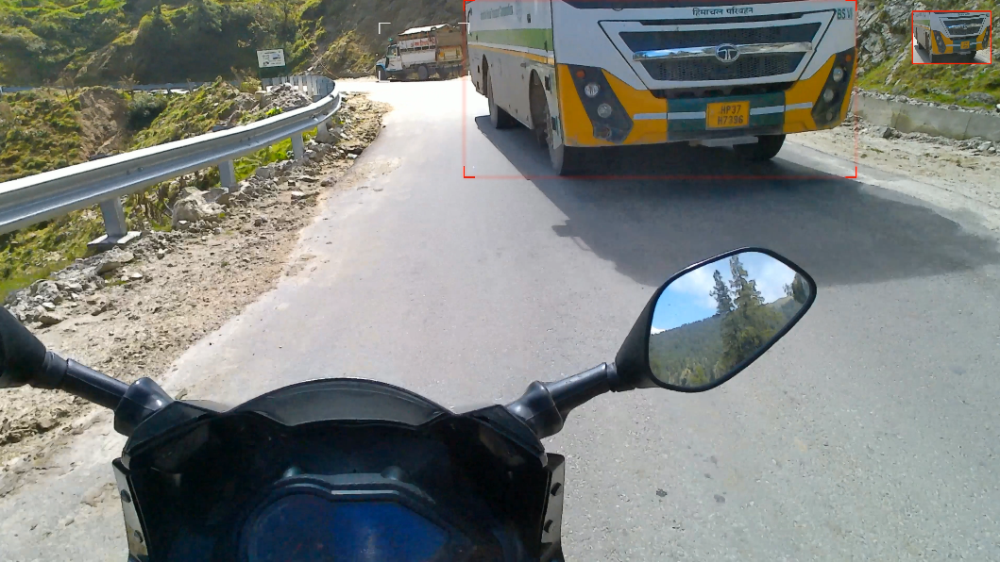
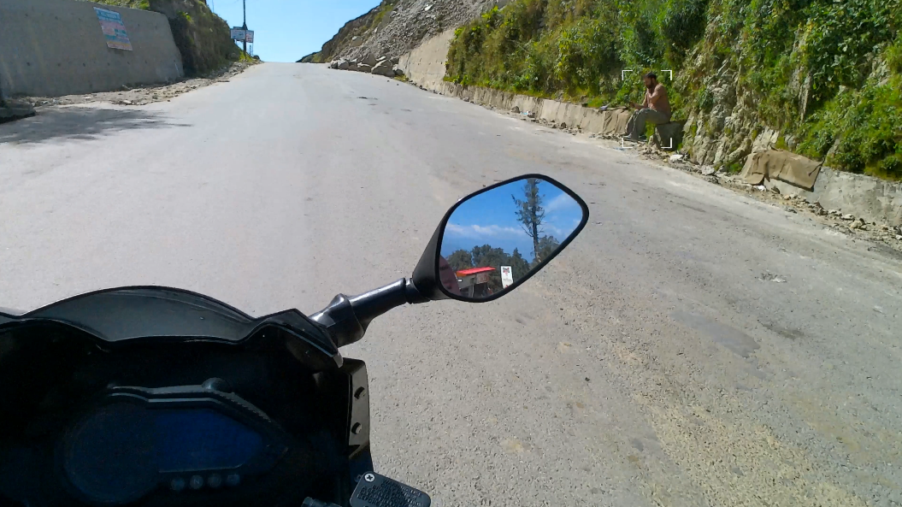
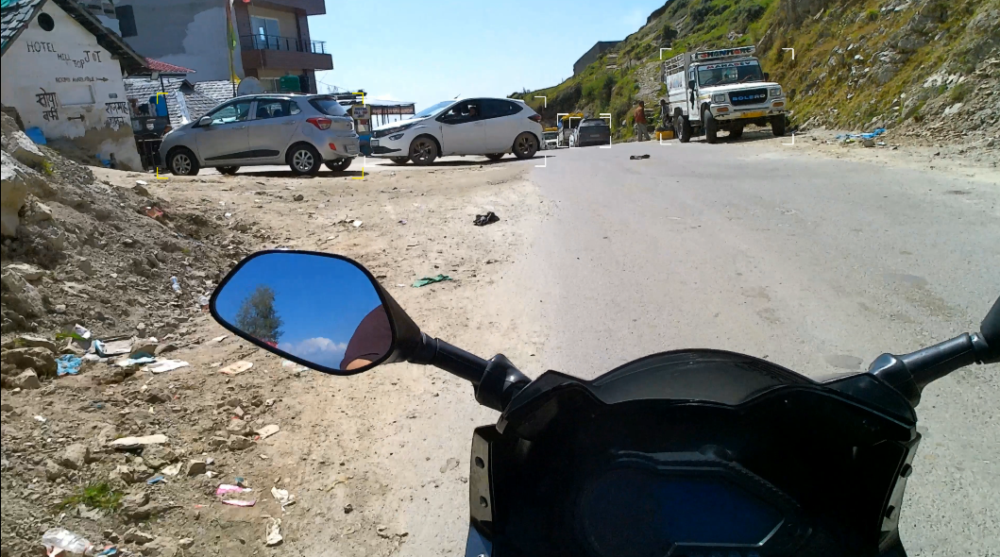
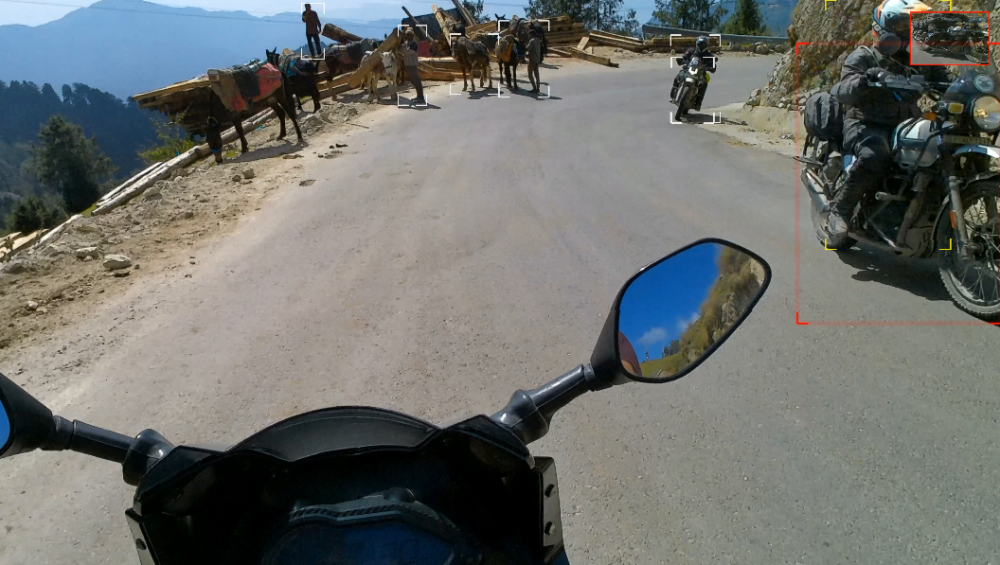

# R.A.S – Rider Assist System

AI-powered motorcycle video intelligence overlay for content creators.

R.A.S enhances rider POV footage by detecting vehicles, pedestrians, and road elements frame-by-frame and applying intelligent threat-based visual overlays.

---

## 🚀 Features

- Frame-by-frame object detection (YOLOv8)
- Threat-level based visual boxes
- Pulse effect for high-risk objects
- Cinematic glow rendering
- Configurable profiles (motorcycle-focused)
- 4K video support
- GPU acceleration (CUDA supported)

---

## 🏍 Designed For

- Moto vloggers
- High-speed POV riders
- Mountain riding footage
- Urban riding analysis
- Content creators seeking AI-enhanced visuals

---

## 🎬 Example Output

## 📂 Project Structure

ras/
engine.py
detection.py
renderer.py
config.py

profiles/
motorcycle.json

ras_cli.py
requirements.txt
README.md

---

## 📦 Requirements

- Python 3.9+
- NVIDIA GPU (recommended)
- CUDA-enabled PyTorch (optional but recommended)
- FFmpeg installed and available in PATH

---

## ⚙ Installation

1. Clone the repository:
git clone https://github.com/yourusername/ras.git

cd ras

2. Install dependencies:
pip install -r requirements.txt

3. Ensure FFmpeg is installed and available in your system PATH.

---

## ▶ Usage

Basic usage:
python ras_cli.py --input input.mp4 --output output.mp4

With profile:
python ras_cli.py --input input.mp4 --output output.mp4 --profile profiles/motorcycle.json

---

## 🖥 GPU Support

R.A.S automatically detects CUDA-enabled GPUs.

Test GPU availability:
python -c "import torch; print(torch.cuda.is_available())"

---

## 🎬 Example Output

Sample output screenshots and demo clips coming soon.

---

## 📌 Roadmap

- [ ] Desktop UI (PyQt6)
- [ ] Preset system
- [ ] Lean angle detection
- [ ] Motion-based speed telemetry
- [ ] Multiple content profiles
- [ ] Real-time preview mode

---

## ⚠ Disclaimer

R.A.S is a post-processing video enhancement tool.  
It is not a real-world safety or rider assist system.

---

## 📄 License

MIT License
